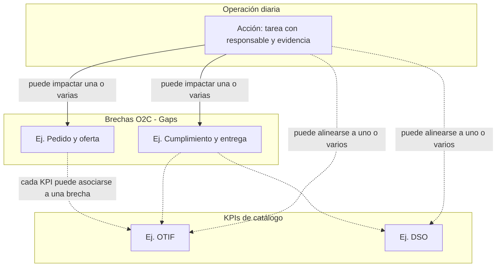

# Brechas (Gaps), KPIs y acciones — Guía para el cliente

Este documento explica, en lenguaje de negocio, **qué son** las brechas O2C (“gaps”), los **KPIs de catálogo** y las **acciones diarias**, y **cómo se relacionan** entre sí dentro del tablero operativo. Sirve para alinear expectativas con equipos directivos, operación y TI.

---

## 1. Idea central en una frase

- **Gap (brecha)** = *qué frente de mejora* estamos atacando en el ciclo pedido–cobro (O2C).  
- **KPI de catálogo** = *cómo medimos* un indicador concreto (con metas, umbrales y semáforo).  
- **Acción** = *qué hace el equipo* día a día para avanzar (tareas con responsable, fechas y evidencia).

**Gap + acciones** describen **ejecución y avance** de la brecha.  
**KPI** describe **medición explícita** del indicador.  
Las acciones pueden **alinearse** a gaps y a KPIs, pero **cerrar una acción no sustituye** registrar el valor medido del KPI.

---

## 2. Qué es una brecha (gap)

Una **brecha** es un **tema o frente de trabajo** del ciclo O2C que la organización quiere mejorar o cerrar: por ejemplo, *pedido y oferta*, *cumplimiento y entrega*, *facturación*, *cobranza* o *rentabilidad y experiencia de cliente*.

**Para qué sirve:**

- Dar **contexto** y **prioridad** al trabajo diario.  
- **Agrupar** iniciativas y ver **avance** (por ejemplo, con puntos de historia en acciones cerradas).  
- Ver en un tablero **en qué brechas** está enfocada la operación.

**En la práctica:** al vincular una acción a una o varias brechas, se dice: *“esta tarea contribuye a cerrar estas brechas”*.

---

## 3. Qué es un KPI de catálogo

Los **KPIs de catálogo** son los **indicadores de negocio** definidos en el sistema (por ejemplo OTIF, DSO, exactitud de facturación, NPS, etc.), con:

- **Línea base** y **metas** en el tiempo.  
- **Tipo de indicador** (por ejemplo: más es mejor, menos es mejor).  
- **Peso** dentro del **portafolio global** de KPIs (para el score y el semáforo ejecutivo).  
- **Vínculo opcional a una brecha**: cada KPI puede estar asociado a la brecha que mejor representa.

**Para qué sirve:**

- Ver **cumplimiento** frente a la meta (porcentaje, semáforo verde / ámbar / rojo).  
- Tener un **score global O2C** ponderado cuando hay mediciones y datos suficientes.  
- Priorizar conversaciones de dirección en torno a **riesgo** y **desempeño medible**.

**Importante:** el valor del KPI se actualiza con **mediciones registradas** (y reglas de cálculo acordadas), no automáticamente porque alguien cierre una acción.

---

## 4. Qué es una acción

Una **acción** es una **tarea operativa concreta**: responsable, plazo, descripción, evidencia esperada y estado (pendiente, en ejecución, hecha, etc.).

**Para qué sirve:**

- Ejecutar el trabajo diario con **trazabilidad** y **rendición de cuentas**.  
- Conectar lo que hace el equipo con **brechas** y, si aplica, con **KPIs** a los que se quiere **impactar de forma alineada** (comunicación y priorización).

---

## 5. Cómo se relacionan gap, KPI y acción

### 5.1 Relación lógica

| Elemento | Rol |
|----------|-----|
| **Gap** | Define **dónde** actuamos en el ciclo O2C (la brecha). |
| **KPI** | Define **cómo medimos** un resultado (el indicador). |
| **Acción** | Define **qué hacemos** (el trabajo). |

Una misma brecha puede tener **varios KPIs** asociados en catálogo (porque una brecha se puede medir con varios indicadores).

Una **acción** puede:

- Impactar **una o varias brechas** (varias brechas seleccionables en el formulario).  
- Estar alineada con **uno o varios KPIs de catálogo** (también seleccionables), siempre que tenga sentido de negocio (por ejemplo, una iniciativa que apoya a varios indicadores).

En el sistema existe además un **vínculo principal** (la primera brecha y el primer KPI seleccionados) para compatibilidad con reportes y columnas históricas; la **lista completa** de brechas y KPIs impactados se guarda en tablas de vínculo.

### 5.2 Lo que la acción **sí** impulsa vs lo que **no** sustituye

| Hacia… | Qué hace la acción |
|--------|-------------------|
| **Brecha (gap)** | **Sí** impulsa el avance operativo (trabajo, estados, puntos de historia donde aplique, seguimiento en tablero de brechas). |
| **KPI de catálogo** | La acción **alinea y comunica** impacto; **no reemplaza** la **medición** del KPI. El cumplimiento del indicador viene de **valores y mediciones registradas** según las reglas del catálogo. |

En una frase para el cliente:

> *Las acciones mueven la brecha; los KPIs se alimentan de mediciones. Las acciones pueden estar etiquetadas hacia KPIs para ver quién trabaja qué, pero el número del KPI sigue siendo responsabilidad del proceso de medición.*

### 5.3 Diagrama de relación (lectura rápida)

---

## 6. Dónde se ve en la aplicación

- **KPIs O2C:** tablero con score global, semáforo por indicador y detalle (cumplimiento, pesos, umbrales).  
- **Gaps O2C:** tablero de brechas con avance, estado de la brecha y visión de KPIs vinculados a cada brecha.  
- **Acciones:** Kanban, listados, dashboard y formulario de creación/edición, donde se eligen **brechas y KPIs** a impactar.

---

## 7. Glosario breve

| Término | Significado para el cliente |
|---------|-----------------------------|
| **O2C** | Ciclo *order-to-cash*: desde el pedido hasta el cobro. |
| **Gap / brecha** | Frente de mejora dentro de ese ciclo. |
| **KPI de catálogo** | Indicador medible con metas y semáforo; puede asociarse a una brecha. |
| **Acción** | Tarea diaria con responsable y seguimiento; puede vincularse a una o varias brechas y KPIs. |
| **Medición** | Registro explícito del valor del KPI; no se sustituye solo con cerrar acciones. |
| **Portafolio global** | Conjunto de KPIs ponderados que alimentan el score ejecutivo (cuando hay datos). |

---

## 8. Mensajes útiles para presentación

1. **“No mezclamos tareas con mediciones.”** Las acciones organizan el trabajo; los KPIs reflejan resultados medidos con reglas claras.  
2. **“Una acción puede apoyar varias brechas o varios KPIs”** cuando la iniciativa es transversal.  
3. **“El tablero de brechas muestra ejecución; el tablero de KPIs muestra desempeño medido.”** Son complementarios.

---

*Documento orientado a presentación comercial y alineamiento funcional. Para detalle técnico de tablas y reglas de cálculo, el equipo puede apoyarse en la documentación interna del repositorio.*
