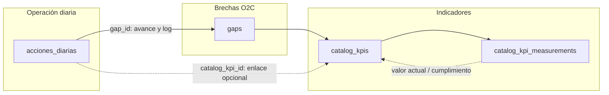

# Gaps, KPIs de catálogo y acciones

> **Presentación cliente (lenguaje de negocio):** [gaps-kpis-acciones-explicacion-cliente.md](./gaps-kpis-acciones-explicacion-cliente.md)

Este documento resume **para qué sirven las brechas (gaps) y los KPIs de catálogo O2C**, y **cómo se relacionan con las acciones diarias** en este producto.

---

## Qué es un **gap** (brecha O2C)

Un **gap** es una **brecha operativa** del ciclo *order-to-cash* (O2C): un tema o frente de trabajo que el equipo quiere cerrar (por ejemplo, mejorar facturación, cobranza o cumplimiento de entregas).

- **Dónde vive en datos:** tabla `gaps` (nombre, descripción, área, estado del gap, responsable opcional, story points totales opcionales, etc.).
- **Para qué sirve en la app:**
  - Agrupa trabajo y **visibilidad**: tablero de gaps, filtros por área/responsable/estado.
  - Permite medir **avance operativo** vinculando **acciones** al gap.

### Cómo lo “afectan” las acciones

Las acciones (`acciones_diarias`) pueden llevar un **`gap_id`**. Eso significa: *esta acción contribuye a cerrar esa brecha*.

- **Progreso por story points:** el avance del gap se calcula con las acciones del gap que están en **Hecho** o **Verificado**, respecto al total de puntos de esas acciones (y, si no hay puntos en acciones, puede usarse el total cacheado en el gap). La lógica está en `computeGapStoryProgress` (`src/features/kpi/utils/gapProgress.ts`).
- **Auditoría:** al pasar una acción a cierre (Hecho) o verificación (Verificado), si tiene `gap_id`, puede registrarse un evento en **`gap_actions_log`** (trazabilidad). **Eso no modifica mediciones de KPI.**

**Importante:** cerrar acciones **no cambia automáticamente** el valor de un KPI de catálogo por medición. El gap refleja **ejecución y avance**; el KPI de catálogo refleja **medición explícita** (ver siguiente sección).

---

## Qué es un **KPI de catálogo O2C**

Los KPIs de negocio O2C viven en **`catalog_kpis`** (no confundir con la tabla legacy `kpis` / semáforo antiguo).

- Cada KPI puede estar **asociado a un gap** (`gap_id`): indica *qué brecha ese indicador está midiendo o apoyando*.
- Tiene **peso** (`weight`) dentro del **portafolio global** de KPIs activos con gap y en portfolio; la suma de esos pesos debe ser ~1 (validación en base de datos).
- El **cumplimiento** se calcula a partir de **baseline**, **metas** (M6 / M12 / M18 según política), tipo de cálculo (maximizar, minimizar, binario) y el **valor actual**, que en la práctica viene de la **última medición** en `catalog_kpi_measurements` (y/o `current_value` como caché).

### Cómo lo “afectan” las acciones

- Las acciones pueden llevar **`catalog_kpi_id`** como **vínculo informativo** (por ejemplo en formularios o reportes): *esta acción está alineada a ese KPI*.
- **Regla de producto:** **cerrar o verificar una acción no escribe una nueva medición de KPI** ni recalcula el KPI automáticamente por ese cierre. Las mediciones de catálogo se registran por su propio flujo (administración / diálogo de medición, según la pantalla).

Por tanto:

| Concepto | Rol de las acciones |
|----------|---------------------|
| **Gap** | Sí impulsa **avance** (story points, estados, log de eventos). |
| **KPI de catálogo** | Las acciones **no sustituyen** las mediciones; el valor del KPI depende de **mediciones registradas** (y reglas de cálculo O2C). |

En conjunto: **gap = ejecución de la brecha**; **KPI = medición del indicador**. Pueden ir **alineados** por diseño (mismo gap, KPIs vinculados), pero el modelo evita que el cierre de tareas **contamine** el histórico de mediciones del KPI.

---

## Resumen visual (mental)

---

## Dónde verlo en la app

- **KPIs O2C:** tablero de KPIs (score global, semáforo, detalle por indicador).
- **Gaps:** tablero de brechas (avance, KPIs vinculados al gap, semáforo agregado por KPIs del gap).
- **Acciones:** Kanban / tablas; al asignar `gap_id` (y opcionalmente `catalog_kpi_id`) quedan enlazadas para seguimiento y reporting.

Si necesitas documentar además **RLS o políticas de Supabase** para mediciones y catálogos, conviene enlazar las migraciones `gaps_o2c_kpis` y las políticas de `catalog_kpi_measurements`.

Gaps vs OKR
Un gap es una brecha operativa O2C que quieres cerrar: agrupa trabajo y te permite ver avance (p. ej. story points en acciones Hecho/Verificado).
Un OKR en el producto es otra pieza (tabla okrs, campo okr_impactado en acciones). Tiene su propia lógica de “objetivo + resultados”.
Analogía: un gap puede parecerse a un “objetivo de mejora” en un área, pero no es lo mismo que un OKR formal del sistema. Si necesitas OKR explícito, usas OKRs; si necesitas brecha O2C, usas gaps.
Acciones y “cumplimiento”
Hacia el gap: las acciones son el camino de ejecución: lo que hace avanzar la brecha (puntos cerrados, estados, trazabilidad en el gap). Ahí sí: las acciones son cómo se trabaja para cerrar el gap.
Hacia el KPI de catálogo: el cumplimiento del KPI no se calcula automáticamente porque cierres acciones; viene de mediciones (catalog_kpi_measurements) y reglas O2C. Las acciones pueden estar alineadas al KPI (catalog_kpi_id), pero no sustituyen registrar el valor/medición.
En una frase: gap + acciones = ejecución y avance de la brecha; KPI = medición explícita del indicador. Se complementan, pero no son el mismo mecanismo.