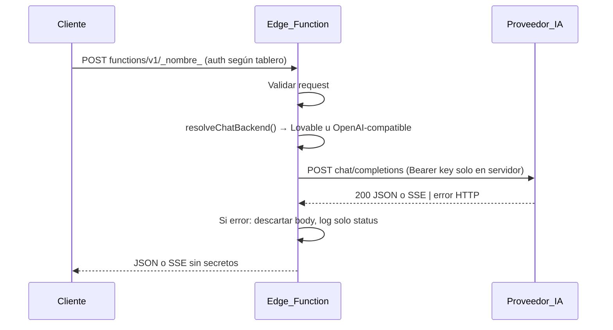

# IA vía Supabase Edge Functions (Lovable y compatible OpenAI)

**Separación de entornos:** las variables `VITE_*` son solo del **build del frontend** (Vercel, Lovable, `.env` local). Los **secrets** de Edge Functions se configuran en **Supabase** sin prefijo `VITE_`. Tabla y reglas: [environment-variables.md](./environment-variables.md).

En este proyecto el cliente **solo** llama a Edge Functions. Las claves del proveedor viven solo en el entorno Deno (`Deno.env.get(...)`), nunca en Vite ni en el navegador.

## Principios de seguridad

1. **No hay `VITE_*` para claves de IA.** El navegador nunca ve ninguna API key.
2. **No se imprimen claves:** no `console.log(apiKey)`, ni enviarlas en respuestas JSON ni en mensajes de error al cliente.
3. Los errores del proveedor upstream se **traducen** a mensajes genéricos; no se reenvía el cuerpo crudo al cliente (evita fugas de datos o texto interno).
4. Los logs ante fallo del upstream solo registran el **código HTTP**, p. ej. `chat_upstream_http_status=429`, nunca el cuerpo de la respuesta.

## Tres entornos típicos

### 1) Proyecto en Lovable Cloud

- **`LOVABLE_API_KEY` es gestionado por Lovable** (inyectado en Edge Functions automáticamente). **No es un valor que puedas copiar**, exportar ni pegar desde un panel público como si fuera “tu clave de OpenAI”.
- **No** ejecutes comandos tipo `supabase secrets set LOVABLE_API_KEY=...` esperando obtener la clave de Lovable: **no existe instrucción de configuración manual equivalente** para ese secreto en este flujo.
- En el código, sigue usando `Deno.env.get("LOVABLE_API_KEY")` (o el helper `resolveChatBackend()` en `_shared/lovableGateway.ts`, que ya lo hace). Asume que el valor estará presente cuando el despliegue sea el de Lovable Cloud.
- Opcional: `LOVABLE_AI_MODEL` o `CHAT_DEFAULT_MODEL` para el modelo por defecto en el gateway Lovable.

### 2) Supabase externo (sin Lovable Cloud)

- **`LOVABLE_API_KEY` no está disponible** en este escenario.
- Configura **tu propia** clave de un proveedor con API **compatible con el esquema de chat completions estilo OpenAI** (OpenAI, un proxy compatible, etc.):
  - `OPENAI_API_KEY` (obligatorio para activar este camino)
  - `OPENAI_API_BASE_URL` (opcional; si no se define, se usa el endpoint estándar de OpenAI)
  - `OPENAI_MODEL` o `CHAT_DEFAULT_MODEL` (opcional)
- Esos valores se definen como **secretos reales** del proyecto Supabase (Dashboard → Edge Functions → Secrets, o `npx supabase secrets set OPENAI_API_KEY=...`, etc.).

### 3) App externa que necesita la misma IA que el proyecto Lovable

- **No** entregues ni expongas `LOVABLE_API_KEY` a la app externa.
- Crea una **Edge Function puente** dentro del proyecto desplegado en Lovable (por ejemplo reutilizando el patrón de `lovable-chat-completions` o una función dedicada con autenticación acotada).
- La app externa llama **solo** a esa función (con el mecanismo de auth que definas: JWT Supabase, API key de aplicación en cabecera validada en la función, etc.).

## Flujo (resumen)



## Despliegue de funciones (CLI)

Para publicar las funciones (ajusta el `project-ref` al tuyo):

```bash
npx supabase functions deploy lovable-chat-completions --project-ref TU_PROJECT_REF
npx supabase functions deploy ai-chat --project-ref TU_PROJECT_REF
npx supabase functions deploy ai-chat-stream --project-ref TU_PROJECT_REF
npx supabase functions deploy ai-insights --project-ref TU_PROJECT_REF
npx supabase functions deploy ai-report --project-ref TU_PROJECT_REF
```

No incluyas en la documentación del equipo pasos para “copiar/pegar tu propio” `LOVABLE_API_KEY` en Secrets de Supabase: en Lovable Cloud ese secreto no se gestiona así; en Supabase externo debes usar **tu** `OPENAI_API_KEY` u otro proveedor compatible.

## Funciones disponibles

| Función | Uso |
|--------|-----|
| **`lovable-chat-completions`** | Proxy genérico: `messages` + `stream` opcional + `model` opcional. |
| `ai-chat`, `ai-chat-stream`, `ai-insights`, `ai-report` | Casos acotados (O2C) con payloads más simples. |

Todas usan `_shared/lovableGateway.ts` para elegir backend según los secretos disponibles.

## Ejemplo desde el cliente (React)

- URL: `{SUPABASE_URL}/functions/v1/lovable-chat-completions`
- Cabeceras: `Content-Type: application/json`, `Authorization: Bearer {access_token}`, `apikey: {anon key}` (mismo patrón que el resto del tablero).
- Cuerpo (sin streaming):

```json
{
  "messages": [
    { "role": "system", "content": "Eres un asistente útil." },
    { "role": "user", "content": "Hola." }
  ]
}
```

Con streaming: `{ "messages": [...], "stream": true }` y consumir la respuesta como **SSE** (`text/event-stream`).

## Códigos de error tratados (hacia el cliente)

| Upstream | Respuesta típica al cliente |
|---------|------------------------------|
| 402 | Créditos insuficientes |
| 429 | Demasiadas solicitudes |
| 503 | Servicio no disponible |
| 500 | Error interno proveedor (mapeado a 502 en el proxy en algunos casos) |
| Otros | 502 genérico |

## Referencia

- Guía ampliada del producto: [docs/ia.md](./ia.md).
