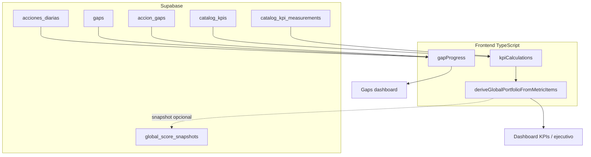

# Sistema de puntuación O2C — documento maestro (alineado al código)

Versión alineada al repositorio actual (`catalog_kpis`, `acciones_diarias`, motor en TypeScript). Las referencias antiguas a `user_stories`, `useBacklog` y `backlogData.ts` **ya no aplican**: ese modelo fue sustituido por acciones diarias enlazadas a gaps y KPIs de catálogo.

---

## 1. Visión general

### 1.1 Dos lecturas que conviene no mezclar

| Lectura | Qué responde | Fuente principal |
|--------|----------------|------------------|
| **Salud operativa (score global O2C)** | ¿Qué tan cerca están los KPIs medidos de sus metas, ponderados en el portafolio? | `catalog_kpis` + `catalog_kpi_measurements` + funciones en `src/features/kpi/utils/kpiCalculations.ts` |
| **Avance de ejecución (transformación)** | ¿Qué tanto trabajo planificado (story points) ya está cerrado por gap? | `acciones_diarias` + `accion_gaps` + `computeGapStoryProgress` en `gapProgress.ts` |

El score global **no** es lo mismo que el porcentaje de puntos Hecho en acciones: uno es cumplimiento de **métricas**; el otro es **cerramiento de backlog** por brecha.

### 1.2 Conceptos

- **KPI (catálogo):** fila en `catalog_kpis` con baseline, metas M3/M6/M12/M18 (según migraciones), peso `weight`, tipo `calc_type` (`maximize` \| `minimize` \| `binary`), opcionalmente `gap_id`, banderas `activo`, `in_global_portfolio`.
- **Medición:** serie temporal en `catalog_kpi_measurements`; el cliente suele usar la última medición para el valor actual de cómputo.
- **Gap:** tabla `gaps`; las acciones se asocian por `acciones_diarias.gap_id` y/o tabla puente `accion_gaps`.
- **Acción:** `acciones_diarias` — incluye `story_points`, `estado`, `gap_id`, `catalog_kpi_id` (opcional). Estados **cerrados para puntos “Done”** del backlog en KPI/gaps: `Hecho` y `Verificado` (véase `isAccionEstadoDone` en `gapProgress.ts`).

### 1.3 Flujo lógico (implementado)



---

## 2. Score global O2C (salud operativa)

### 2.1 Definición en código

Para el conjunto de KPIs que pasan el filtro de **portafolio global** (`activo`, `gap_id` no nulo, `in_global_portfolio`):

\[
\text{ScoreGlobal} = \frac{\sum_i w_i \cdot c_i}{\sum_i w_i}
\]

donde \(w_i\) es el peso del KPI y \(c_i\) el **cumplimiento** en \([0,1]\), **solo para KPIs con cumplimiento válido** (`calculateCompliance` ≠ `null`) y peso finito \(> 0\). Los KPIs sin medición válida **no entran en la suma** del numerador ni del denominador: efectivamente los pesos activos se **renormalizan** entre los elegibles (`sumWeightedComplianceParts`).

Implementación: `calculateGlobalScore`, `deriveGlobalPortfolioFromMetricItems` en [`src/features/kpi/utils/kpiCalculations.ts`](src/features/kpi/utils/kpiCalculations.ts).

### 2.2 Cobertura y advertencias

- **Cobertura:** `deriveGlobalCoverage` expone peso total del portafolio vs peso que efectivamente entró al score (`eligibleWeight`, `missingWeight`).
- **Suma de pesos del portafolio global ≠ 1:** si la suma de `weight` de KPIs activos con `gap_id` e `in_global_portfolio` no está ~1 (tolerancia `GLOBAL_PORTFOLIO_WEIGHT_TOLERANCE`), `globalPortfolioWeightWarning` se muestra en el widget **Score Global O2C** ([`GlobalScoreWidget`](src/features/kpi/components/GlobalScoreWidget.tsx)) y en **KPIs O2C**. La misma regla se valida al editar KPIs en catálogo ([`kpiPortfolioWeights.ts`](src/features/catalogs/utils/kpiPortfolioWeights.ts)).
- **Por gap:** puede haber varios KPIs por gap; **no se exige** que la suma de pesos por gap sea 1 (referencia analítica en el tablero KPIs).
- **Renormalización por datos:** KPIs sin cumplimiento válido no entran al score; entre los que sí entran, la media ponderada equivale a renormalizar pesos sobre ese subconjunto (además de que los pesos declarados en catálogo deban sumar 1 en el portafolio global).

### 2.3 Semáforos por KPI (cumplimiento normalizado)

Sobre el valor **cumplimiento** \(c \in [0,1]\) (no sobre el valor crudo del KPI):

| Estado | Condición (defaults globales) |
|--------|-------------------------------|
| `on_track` | \(c \ge\) umbral verde |
| `at_risk` | \(c \ge\) umbral amarillo y \(c &lt;\) verde |
| `off_track` | \(c &lt;\) umbral amarillo |

**Defaults en código:** verde ≥ **0.85**, amarillo ≥ **0.60** (`KPI_COMPLIANCE_ON_TRACK_MIN`, `KPI_COMPLIANCE_AT_RISK_MIN` en [`src/features/kpi/utils/kpiThresholds.ts`](src/features/kpi/utils/kpiThresholds.ts)).  
Por KPI se pueden sobrescribir con columnas `threshold_green` / `threshold_yellow` en `catalog_kpis` (normalización para que verde ≥ amarillo en `normalizeKpiComplianceBandThresholds`).

### 2.4 Histórico

La tabla `global_score_snapshots` guarda valores en **[0, 1]**. La función RPC `record_global_score_snapshot` permite registrar puntos deduplicados por día/score; el cliente usa [`globalScoreSnapshots.service.ts`](src/features/kpi/services/globalScoreSnapshots.service.ts). La evolución en dashboard ejecutivo combina pipeline actual + snapshots vía [`useGlobalScoreEvolution`](src/features/kpi/hooks/useGlobalScoreEvolution.ts).

### 2.5 Dashboard ejecutivo (`/dashboard`)

- **Score Global O2C:** [`GlobalScoreWidget`](src/features/kpi/components/GlobalScoreWidget.tsx) vía [`DashboardScoreAndRoadmapSection`](src/pages/dashboard/components/DashboardScoreAndRoadmapSection.tsx): valor ponderado, tendencia desde snapshots, semáforos agregados, cobertura, suma de pesos del portafolio global y aviso si ≠ 1.
- **Score MD (documento KPIs):** el panel expandible [`GlobalScoreMdSpecPanel`](src/features/kpi/components/GlobalScoreMdSpecPanel.tsx) ya no está en `/dashboard`; los puntos y semáforos alineados al documento KPIs siguen en **KPIs O2C** dentro de [`PortfolioHealthExecutiveSection`](src/features/kpi/components/PortfolioHealthExecutiveSection.tsx).
- **Semáforo por KPI:** [`CatalogKpiSemaforoGrid`](src/features/kpi/components/CatalogKpiSemaforoGrid.tsx): meta activa, peso, aporte ponderado, última medición y **Registrar medición**.
- **API documentada (aliases):** [`src/features/kpi/utils/o2cScoreEngine.ts`](src/features/kpi/utils/o2cScoreEngine.ts).

---

## 3. KPIs — cumplimiento

### 3.1 Valor actual para el cálculo

Hay dos políticas en [`resolveCatalogKpiObservationValue`](src/features/kpi/utils/kpiCalculations.ts):

| Política | Comportamiento |
|----------|----------------|
| **`measurement_only`** (default en hooks/UI del score global) | Valor observado = última medición en `catalog_kpi_measurements`, o si no hay serie, **`current_value`** en `catalog_kpis`. La **baseline no sustituye** al valor actual: sin medición ni `current_value`, el KPI **no tiene cumplimiento** (`null`) y **queda fuera** del score global (pesos renormalizados entre los demás). Evita mostrar 0 % «como si hubiera medición». |
| **`baseline_fallback`** | Equivalente a [`resolveCatalogKpiCurrent`](src/features/kpi/utils/kpiCalculations.ts): última medición → `current_value` → **baseline** como punto de partida (útil en demos o vistas exploratorias). |

Por defecto de producto se usa **`measurement_only`** en `computeCatalogKpiMetricItem` / `useCatalogKpiMetricsList`.

### 3.2 Meta efectiva

`resolveTarget(kpi, horizon)` con `TargetHorizon` `m6` \| `m12` \| `m18` y fallback hacia metas posteriores si las intermedias son null. Por defecto de producto: horizonte **M18** (`DEFAULT_O2C_TARGET_HORIZON`). El mes de programa para variantes MD/spec puede depender de `VITE_O2C_PROGRAM_START` (véase [`docs/KPIs.md`](docs/KPIs.md), [`docs/environment-variables.md`](docs/environment-variables.md)).

### 3.3 Fórmulas de cumplimiento

Implementadas en `calculateCompliance`:

- **maximize / minimize:** interpolación lineal entre baseline y meta con `clamp01`; configuraciones inconsistentes (p. ej. maximize con meta &lt; baseline sin tratamiento especial) pueden devolver `null`.
- **binary:** cumplimiento 1 si valor actual ≈ meta (epsilon numérica), 0 si no.

Semáforo sobre ese \(c\): `getKpiStatus` / `getKpiStatusForMetric`.

---

## 4. Gaps (brechas)

### 4.1 Progreso por gap (ejecución)

**Por story points**, no por conteo de tarjetas:

\[
\text{progressPct} = \begin{cases}
100 \cdot \dfrac{\text{donePoints}}{\text{totalPoints}} & \text{si totalPoints} > 0 \\
0 & \text{en otro caso}
\end{cases}
\]

donde `donePoints` y `totalPoints` suman `story_points` de acciones del gap con estados considerados cerrados (`Hecho`, `Verificado`). Si ninguna acción aporta puntos pero el gap tiene `total_story_points` en catálogo, ese valor puede usarse como denominador fallback (`computeGapStoryProgress`).

Implementación: [`src/features/kpi/utils/gapProgress.ts`](src/features/kpi/utils/gapProgress.ts), uso en [`GapsDashboardPage.tsx`](src/features/kpi/pages/GapsDashboardPage.tsx).

### 4.2 Severidad de negocio en UI

La tarjeta de gap clasifica una **severidad de presentación** (`deriveGapSeveridad`) combinando estado del gap (`closed`/`resolved` → controlado) con el semáforo del KPI “principal” del gap (primer métrico ordenado). **No** existe en código una fórmula escalar tipo  
`prioridad_weight × (1 - progressPct) × Σ pesos KPI` (idea exploratoria del doc histórico).

### 4.3 Impacto estimado de una acción al score global de referencia

Metodología narrativa en [`docs/KPIs.md`](docs/KPIs.md) §13 y código [`computeStoryGlobalImpactPercent`](src/features/kpi/utils/storyPointsMethodology.ts): combina suma de pesos KPI del gap, número de acciones en el gap y participación por puntos.

---

## 5. Acciones (`acciones_diarias`)

- Cambiar estado vía operaciones/Kanban actualiza filas en BD; los agregados de gap se recalculan al refrescar datos (React Query).
- Evidencia: campos como `evidencia_cargada` / adjuntos existen en la entidad; **no** son inputs directos del motor de score global O2C (salvo futuras reglas explícitas).

---

## 6. Pseudocódigo SQL ilustrativo (no es vista materializada del repo)

Las agregaciones **oficiales** están en TypeScript; lo siguiente solo ayuda a entender equivalencias:

```sql
-- Avance por gap por puntos (espíritu de computeGapStoryProgress)
SELECT gap_id,
       ROUND(100.0 * SUM(story_points) FILTER (
         WHERE estado IN ('Hecho', 'Verificado')) / NULLIF(SUM(story_points), 0)) AS progress_pct
FROM acciones_diarias
WHERE gap_id IS NOT NULL
GROUP BY gap_id;
```

El score global O2C desde SQL replicaría reglas de `calculateCompliance` y filtros de portafolio; **no** hay vista `v_score_global` mantenida en migraciones — ver §10.

---

## 7. Tablas y artefactos Supabase relevantes

| Objeto | Rol |
|--------|-----|
| `gaps` | Brechas O2C |
| `catalog_kpis` | KPIs con pesos, metas, umbrales, `gap_id`, `in_global_portfolio` |
| `catalog_kpi_measurements` | Serie de valores por KPI |
| `acciones_diarias` | Acciones con `story_points`, `estado`, `gap_id`, `catalog_kpi_id` |
| `accion_gaps` | Vincula acciones adicionales a gaps |
| `accion_catalog_kpis` | N:N acción ↔ KPI de catálogo |
| `global_score_snapshots` | Histórico score 0–1 |
| `record_global_score_snapshot` | RPC para insertar snapshot con dedupe |

Migraciones de referencia: `20260313500000_gaps_o2c_kpis.sql`, `20260411120000_record_global_score_snapshot_rpc.sql`, seeds KPI/GAP según entorno.

---

## 8. Dónde vive cada cálculo

| Cálculo | Ubicación | Notas |
|---------|-----------|--------|
| Cumplimiento KPI | `kpiCalculations.ts` (`calculateCompliance`) | Cliente |
| Score global portafolio | `calculateGlobalScore`, `deriveGlobalPortfolioFromMetricItems` | Cliente |
| Semáforo KPI | `getKpiStatus`, `getKpiStatusForMetric` | Cliente |
| Progreso gap por puntos | `gapProgress.ts` | Cliente |
| Variación / narrativa temporal score | `globalScoreEvolution.ts`, `useGlobalScoreEvolution` | Cliente |
| Score especificación MD (documento KPIs) | `kpiMdSpecCalculations.ts` | Paralelo al score O2C 0–1; conviven en dashboard |

**Implicación:** reportes externos que necesiten el mismo número deben reutilizar esta lógica (exportar función compartida, API backend o vista SQL mantenida a mano).

---

## 9. Casos especiales y edge cases

| Caso | Comportamiento esperado |
|------|-------------------------|
| KPI sin valor actual válido | `calculateCompliance` → `null`; no entra al score global |
| Pesos portafolio ≠ 1 | Aviso vía `globalPortfolioWeightWarning` |
| Gap sin acciones con puntos | Fallback `total_story_points` del gap si existe; si no, barras en 0 |
| Acción con `story_points = 0` | Cuenta en total si suma 0; no mueve proporciones |
| baseline/meta inconsistentes | Puede devolver `null` en maximize/minimize |
| Umbrales invertidos en BD | `normalizeKpiComplianceBandThresholds` corrige orden |

---

## 10. Extensiones opcionales (mantenimiento / futuro)

Estas piezas **no** están implementadas como código reusable único en SQL ni como fórmula única de severidad:

1. **Severidad escalar §4.5 (histórico):** si el negocio la define, conviene extraer una función pura (tests unitarios) y usarla desde `GapsDashboardPage` en lugar de solo heurística por estado + primer KPI.
2. **Vista SQL `v_score_global`:** útil para BI; duplica reglas ya centralizadas en TypeScript — cualquier cambio en `calculateCompliance` obligaría a actualizar SQL en paralelo salvo que se mueva el cómputo a Postgres/RPC.

Registrar snapshots tras cambios relevantes (`record_global_score_snapshot`) mitiga falta de vista única para tendencias.

---

## 11. Apéndice A — Archivos clave

| Archivo | Responsabilidad |
|---------|------------------|
| [`src/features/kpi/utils/kpiCalculations.ts`](src/features/kpi/utils/kpiCalculations.ts) | Cumplimiento, score global, cobertura, pesos por gap |
| [`src/features/kpi/utils/kpiThresholds.ts`](src/features/kpi/utils/kpiThresholds.ts) | Defaults 0.85 / 0.60 |
| [`src/features/kpi/utils/gapProgress.ts`](src/features/kpi/utils/gapProgress.ts) | Progreso gap por puntos |
| [`src/features/kpi/utils/storyPointsMethodology.ts`](src/features/kpi/utils/storyPointsMethodology.ts) | Impacto % historia vs score de referencia |
| [`src/features/kpi/pages/GapsDashboardPage.tsx`](src/features/kpi/pages/GapsDashboardPage.tsx) | Cards gaps + severidad UI |
| [`src/pages/dashboard/DashboardPage.tsx`](src/pages/dashboard/DashboardPage.tsx) | Ejecutivo + score evolution |
| [`src/features/kpi/pages/KpisDashboardPage.tsx`](src/features/kpi/pages/KpisDashboardPage.tsx) | Tablero KPIs O2C |
| [`src/features/kpi/hooks/useGlobalScoreEvolution.ts`](src/features/kpi/hooks/useGlobalScoreEvolution.ts) | Pipeline score + snapshots + texto tendencia |
| [`docs/KPIs.md`](docs/KPIs.md) | Metodología extendida y MD spec |

---

## 12. Resumen ejecutivo

- El tablero ofrece **score global O2C** (KPIs medidos y ponderados) y **avance por gap** (story points cerrados): métricas distintas.
- Los semáforos por KPI usan por defecto cumplimiento ≥ **85 %** verde y ≥ **60 %** amarillo salvo override en catálogo.
- Persistencia de KPIs y mediciones está en **Supabase**; la agregación principal corre en **frontend** salvo snapshots explícitos.
